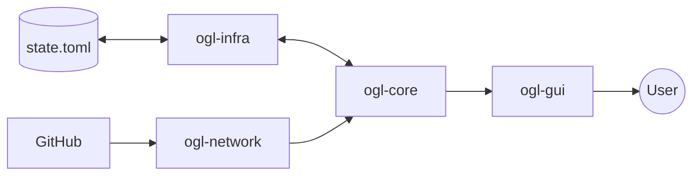

# Data Flow

This document maps how information moves through the system, from external sources to the internal state.

## 1. Configuration Data Flow (Persistence)
- **Origin**: `state.toml` (disk)
- **Path**: `ogl-infra` -> `ConfigStore::load()` -> `LauncherConfig` (domain) -> `LauncherService` -> `SharedUiState`.
- **Update**: `UI Action` -> `view_model` -> `LauncherService` -> `ConfigStore::save()` -> `state.toml`.

## 2. Remote Metadata Flow
- **Origin**: GitHub API (JSON/HTML)
- **Path**: `ogl-network` -> `ReleaseProvider` -> `EngineRelease` (domain) -> `LauncherService`.

## 3. Game Environment Data (Discovery)
- **Origin**: OS Registry / Filesystem
- **Path**: `ogl-infra` -> `InstallDetector` -> `GothicInstall` (domain) -> `LauncherService` -> `SharedUiState`.

## 4. Launch Arguments Flow
- **Origin**: Domain models (`GameState`, `GothicInstall`, `EngineVersion`).
- **Processing**: `LauncherService` combines these into a `GameLaunch` context.
- **Sink**: `ogl-executor` converts `GameLaunch` into CLI strings (`Command::args`).

