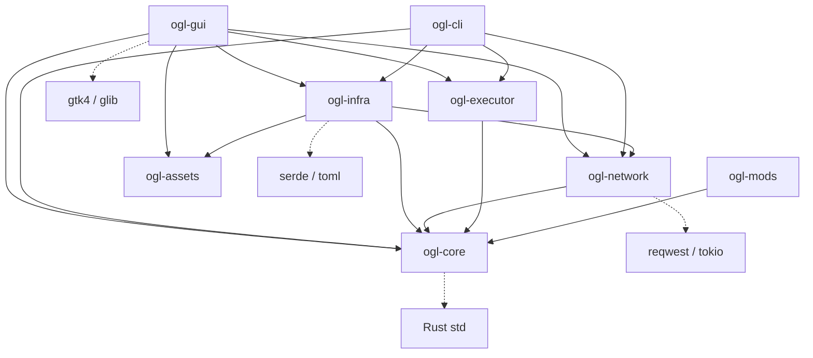

# Module Dependency Graph

The following graph illustrates the compile-time dependencies between workspace crates. Notice the central position of `ogl-core`, which has no outgoing dependencies within the workspace, adhering to the Clean Architecture rule.

### Dependency Rules
- **Rule 1**: No module can depend on `ogl-gui` or `ogl-cli`.
- **Rule 2**: `ogl-core` must remain independent of all other internal crates.
- **Rule 3**: Circular dependencies are strictly prohibited by the Rust compiler and the architectural design.
