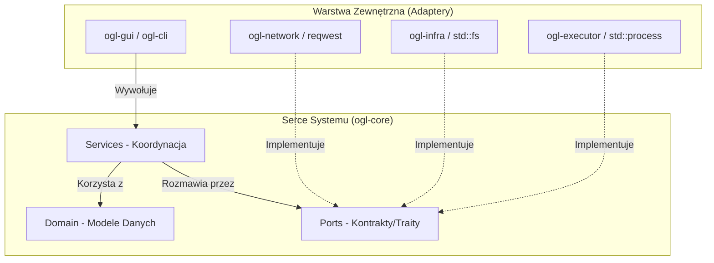
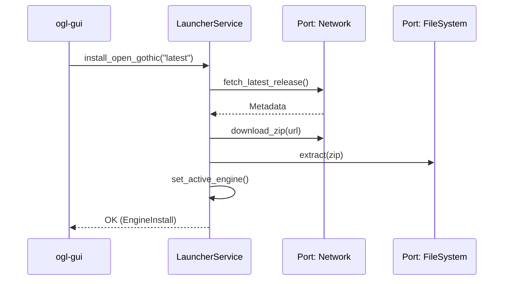

# 02. Architektura Systemu - OpenGothicLauncher

Projekt OpenGothicLauncher wykorzystuje nowoczesne wzorce projektowe: **Clean Architecture** oraz **Architekturę Hexagonalną (Ports & Adapters)**.

## 1. Filozofia Projektowa
Głównym celem jest całkowita separacja logiki biznesowej od technologii zewnętrznych (GUI, sieć, system plików). Dzięki temu "serce" aplikacji (`ogl-core`) jest łatwe do testowania i niezależne od użytych bibliotek czy systemu operacyjnego.

## 2. Warstwy w `ogl-core`

### Domena (`src/domain/`)
Czyste modele danych bez żadnych zależności zewnętrznych.
- `GothicInstall`: Reprezentuje znalezioną grę.
- `EngineVersion`: Reprezentuje konkretne wydanie silnika.
- `LauncherConfig`: Stan konfiguracji (profile, aktywny silnik).

### Porty (`src/ports/`)
Definiują "czego aplikacja potrzebuje od świata". To interfejsy (traits) Rusta.
- `InstallDetector`: Szukanie gier.
- `FileSystem`: Dostęp do dysku.
- `EngineDownloader`: Komunikacja sieciowa.

### Serwisy (`src/services/`)
Logika orkiestracji. Serwisy przyjmują Porty (DI) i realizują zadania.
- **LauncherService**: Główny punkt zarządzania. Odpowiada za instalację silnika, skanowanie modów i przygotowanie gry do startu.

## 3. Kluczowe Przepływy (Sequence)

Przykład pobierania i aktywacji silnika:

## 4. Zasada Zależności (DIP)
Zależności zawsze kierują się **do wewnątrz**. Adaptery (np. `ogl-network`) zależą od `ogl-core` (bo implementują jej traity), ale `ogl-core` nie wie nic o istnieniu `reqwest` czy konkretnego adaptera.
