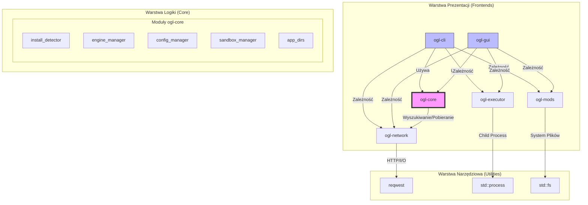

# Architecture Map - OpenGothicLauncher

Ten dokument przedstawia pełną mapę architektury projektu OpenGothicLauncher, ilustrując zależności między komponentami oraz ich odpowiedzialności.

## Diagram Systemu

## Szczegółowy Opis Komponentów

### 1. Frontendy (Prezentacja)

*   **[ogl-gui](file:///home/kacper/Documents/GitHub/OpenGothicLauncher/crates/ogl-gui)**:
    *   **Technologia**: GTK4 (`gtk4-rs`).
    *   **Rola**: Główne okno aplikacji, lista profili, zarządzanie silnikami, pasek postępu pobierania.
    *   **Dokumentacja**: [ogl-gui.md](file:///home/kacper/Documents/GitHub/OpenGothicLauncher/docs/ogl-gui.md)
*   **[ogl-cli](file:///home/kacper/Documents/GitHub/OpenGothicLauncher/crates/ogl-cli)**:
    *   **Technologia**: `clap`.
    *   **Rola**: Alternatywny interfejs dla fanów terminala, automatyzacja.
    *   **Dokumentacja**: [ogl-cli.md](file:///home/kacper/Documents/GitHub/OpenGothicLauncher/docs/ogl-cli.md)

### 2. Warstwa Core (Logika Biznesowa)

Centralny punkt aplikacji, niezależny od UI.

*   **[ogl-core](file:///home/kacper/Documents/GitHub/OpenGothicLauncher/crates/ogl-core)**:
    *   **install_detector**: Algorytm wykrywania Gothic 1/2 na różnych platformach (Steam/GOG/bruteforce).
    *   **engine_manager**: Logika zarządzania wersjami silnika OpenGothic.
    *   **config_manager**: Zarządzanie profilami i ustawieniami.
    *   **Dokumentacja**: [ogl-core.md](file:///home/kacper/Documents/GitHub/OpenGothicLauncher/docs/ogl-core.md) i [game_detection_strategy.md](file:///home/kacper/Documents/GitHub/OpenGothicLauncher/docs/game_detection_strategy.md)

### 3. Moduły Pomocnicze (Utilities)

Pojedyncze odpowiedzialności, używane przez Core i Frontendy.

*   **[ogl-network](file:///home/kacper/Documents/GitHub/OpenGothicLauncher/crates/ogl-network)**: Pobieranie assetów z GitHuba, weryfikacja sum kontrolnych. [Dokumentacja](file:///home/kacper/Documents/GitHub/OpenGothicLauncher/docs/ogl-network.md)
*   **[ogl-executor](file:///home/kacper/Documents/GitHub/OpenGothicLauncher/crates/ogl-executor)**: Abstrakcja nad uruchamianiem silnika z parametrami. [Dokumentacja](file:///home/kacper/Documents/GitHub/OpenGothicLauncher/docs/ogl-executor.md)
*   **[ogl-mods](file:///home/kacper/Documents/GitHub/OpenGothicLauncher/crates/ogl-mods)**: Skanowanie i obsługa plików VDF/MOD. [Dokumentacja](file:///home/kacper/Documents/GitHub/OpenGothicLauncher/docs/ogl-mods.md)

## Przepływ pracy (Workflow)

1.  **Inicjalizacja**: GUI/CLI odczytuje konfigurację przez `ogl-core::config_manager`.
2.  **Detekcja**: Jeśli brak gry, uruchamiany jest `ogl-core::install_detector`.
3.  **Zarządzanie**: Użytkownik wybiera wersję OpenGothic, `engine_manager` pobiera ją przez `ogl-network`.
4.  **Uruchomienie**: `ogl-executor` wystawia polecenie startujące proces gry z odpowiednimi ścieżkami.
