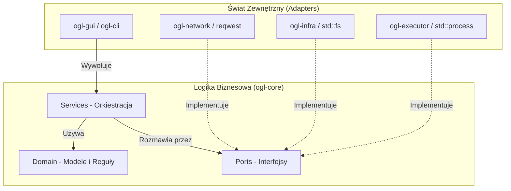
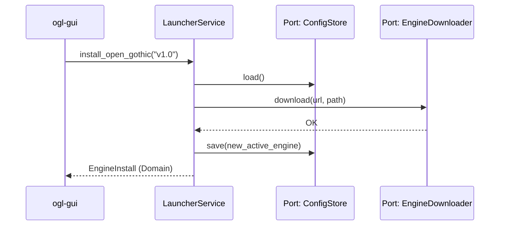

# Szczegółowa Architektura - OpenGothicLauncher

Projekt OpenGothicLauncher przeszedł ewolucję w stronę **Architektury Hexagonalnej** (Ports & Adapters) oraz **Clean Architecture**. Ten dokument opisuje struktury, przepływy i zasady rządzące tą architekturą.

## 1. Filozofia: Separacja Wykonania od Logiki

Głównym założeniem jest to, że "serce" aplikacji (`ogl-core`) nie powinno wiedzieć nic o systemie plików, sieci, procesach systemowych czy bibliotece graficznej. Zamiast tego, definiuje ono **zadania** (Interfejsy/Porty), a inne moduły dostarczają ich **wykonanie** (Adaptery).

## 2. Mapa Warstw i Komponentów

### A. Warstwa Domeny (`src/domain/`)
Zawiera "czyste" struktury danych i logikę biznesową. Zero zależności od IO.

| Moduł | Kluczowe Obiekty | Opis |
|-------|------------------|------|
| `config` | `LauncherConfig`, `GameState` | Centralny stan aplikacji i gier. |
| `engine` | `EngineVersion`, `EngineAsset`, `EngineRelease` | Modele binarne silnika OpenGothic. |
| `install`| `GothicGame`, `GothicInstall` | Definicja wariantów gry i ich lokalizacji. |
| `launch` | `GameLaunch` | Pełny kontekst potrzebny do startu procesu. |
| `mods`   | `ModInfo`, `ModManager` | Metadane o plikach `.vdf` i `.mod`. |

### B. Warstwa Portów (`src/ports/`)
Definiuje "kontrakty" z zewnętrznym światem. Są to traity Rusta.

| Port | Odpowiedzialność | Kto Implementuje (Adapter) |
|------|------------------|----------------------------|
| `AppPaths` | Zwraca ścieżki do folderów danych/config. | `ogl-infra::paths` |
| `FileSystem` | Operacje dyskowe (exists, read, write). | `ogl-infra::filesystem` |
| `ConfigStore` | Trwały zapis i odczyt konfiguracji. | `ogl-infra::config_store` |
| `InstallDetector` | Wykrywanie gier (Steam/Registry itp.). | `ogl-infra::install_detector` |
| `ReleaseProvider` | Sprawdzanie nowych wersji na GitHubie. | `ogl-network::releases` |
| `EngineDownloader`| Pobieranie plików binarnych silnika. | `ogl-network::downloads` |
| `ArchiveExtractor`| Rozpakowywanie archiwów `.zip`. | `ogl-infra::archive` |
| `GameProcessRunner`| Fizyczne uruchomienie procesu gry. | `ogl-executor` |
| `ModFilesProvider`| Dostarczanie listy plików modów. | `ogl-infra::mod_files` |
| `PlatformProvider`| Rozpoznawanie systemu operacyjnego. | `ogl-infra::platform` |

### C. Warstwa Serwisów (`src/services/`)
Logika "mózgu" aplikacji, która koordynuje współpracę portów.

**`LauncherService`**:
- `install_open_gothic`: Pobiera wersję, rozpakowuje ją i ustawia jako aktywną.
- `launch_profile`: Zbiera dane o instalacji, wybiera silnik i zleca start runnerowi.
- `scan_for_installations`: Przeszukuje system za pomocą detektora instalacji.
- `list_installed_engines`: Przeszukuje dysk w poszukiwaniu gotowych do użycia silników.

## 3. Przepływ Informacji (Control Flow)

1. **Start**: `ogl-gui` prosi `LauncherService` o listę silników.
2. **Akcja Core**: `LauncherService` wywołuje port `AppPaths` (by wiedzieć gdzie szukać) i `FileSystem` (by sprawdzić co tam jest).
3. **Wynik**: Serwis zwraca listę `EngineVersion` (obiekt domeny), którą GUI następnie wyświetla.

## 4. Iniekcja Zależności (DI)

Wszystkie adaptery są pakowane w `Arc<dyn Port>` i przekazywane do `LauncherService` przy tworzeniu. Dzięki temu:
- `LauncherService` może być używany w `ogl-cli` bez zmian.
- Możemy łatwo dodać nowy adapter, np. `CloudConfigStore`, bez modyfikacji logiki wewnątrz `ogl-core`.

## 5. Zasada Zależności (DIP)

W Clean Architecture zależności zawsze kierują się **do wewnątrz**.
- `ogl-infra` zależy od `ogl-core` (bo implementuje jej porty).
- `ogl-core` **nie zależy** od `ogl-infra`, `ogl-network` ani `ogl-executor`.
- `ogl-core` zależy tylko od samej siebie (swoich portów i domeny).
