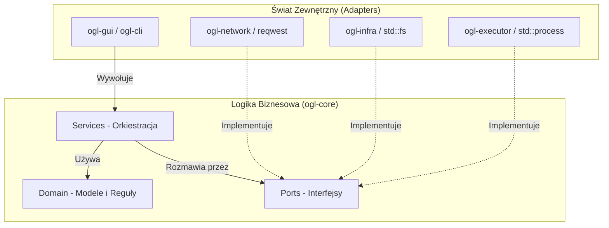

# Szczegółowa Architektura - OpenGothicLauncher

Projekt OpenGothicLauncher przechodzi ewolucję w stronę **Architektury Hexagonalnej** (Ports & Adapters) oraz **Clean Architecture**. Ten dokument opisuje struktury, przepływy i zasady rządzące tą architekturą.

## 1. Filozofia: Separacja Wykonania od Logiki

Głównym założeniem jest to, że "serce" aplikacji (`ogl-core`) nie powinno wiedzieć nic o systemie plików, sieci, procesach systemowych czy bibliotece graficznej. Zamiast tego, definiuje ono **zadania** (Interfejsy/Porty), a inne moduły dostarczają ich **wykonanie** (Adaptery).

## 2. Warstwy w `ogl-core`

### A. Domain (`src/domain/`)
Zawiera "czyste" struktury danych i logikę, która nie zmienia się niezależnie od tego, jakiej bazy danych czy systemu używamy.
- **Przykłady**: `GothicInstall`, `EngineVersion`, `LauncherConfig`.
- **Zasada**: Nie może importować niczego z innych modułów `ogl-core` (poza innymi modułami domain).

### B. Ports (`src/ports/`)
To zbiór cech (traits) w Rucie, które definiują, co aplikacja musi potrafić zrobić "na zewnątrz".
- `InstallDetector`: "Znajdź mi gry na dysku".
- `EngineDownloader`: "Pobierz plik pod ten URL".
- `GameProcessRunner`: "Uruchom silnik z tymi flagami".

### C. Services (`src/services/`)
Tu odbywa się główna kontrola przepływu (orchestration). Serwisy przyjmują obiekty implementujące Porty (`Arc<dyn Port>`) i używają ich do realizacji celów biznesowych.
- **LauncherService**: Najważniejszy serwis. Koordynuje sprawdzenie wersji silnika, wykrycie gry i finalne uruchomienie procesu.

## 3. Infrastruktura i Adaptery (`ogl-infra`, `ogl-network` itp.)

Adaptery to "mięśnie" aplikacji. Zawierają kod specyficzny dla technologii.
- **`ogl-infra`**: Implementuje porty związane z dyskiem i rejestrem Windows.
- **`ogl-network`**: Implementuje porty związane z komunikacją HTTP.
- **`ogl-executor`**: Implementuje port związany z uruchamianiem procesów.

## 4. Iniekcja Zależności (Dependency Injection)

Wszystkie zależności są wstrzykiwane w momencie startu aplikacji (w `main.rs` w `ogl-gui` lub `ogl-cli`).

**Przykład przepływu:**
1. `ogl-gui` tworzy instancję `NetworkAdapter` i `FilesystemAdapter`.
2. `ogl-gui` tworzy `LauncherService`, przekazując mu te adaptery.
3. Gdy użytkownik kliknie "Graj", `LauncherService` wywołuje port `runner.launch()`, nie wiedząc, że pod spodem `ogl-executor` właśnie tworzy proces w systemie Linux/Windows.

## 5. Korzyści

- **Łatwe Testowanie**: Możemy stworzyć `MockFilesystem` i przetestować całą logikę instalacji silnika bez dotykania prawdziwego dysku.
- **Wieloplatformowość**: Specyficzny kod dla Windows (np. rejestr) jest odizolowany w adapterach, a logika core pozostaje identyczna.
- **Czysty Kod**: Programista pracujący nad interfejsem nie musi martwić się o to, jak sprawdzany jest kod SHA256 pobranego pliku – to zadanie adaptera sieciowego.
